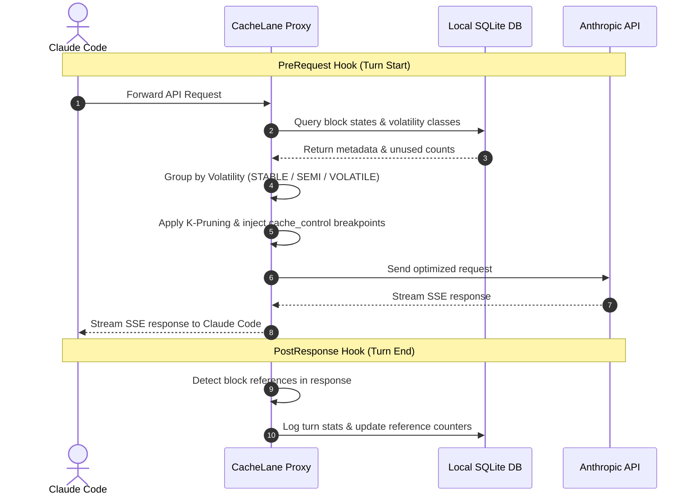
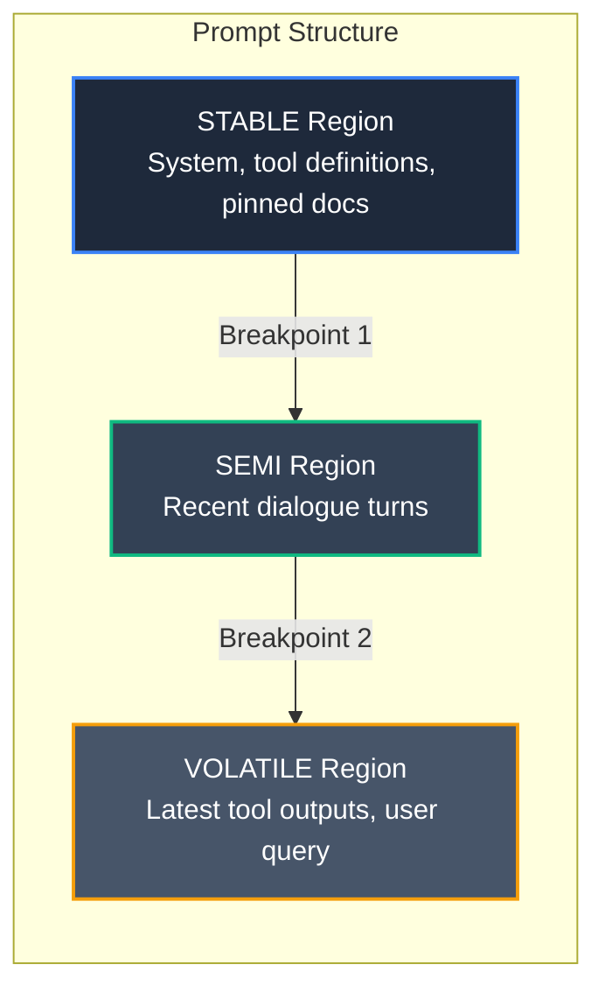
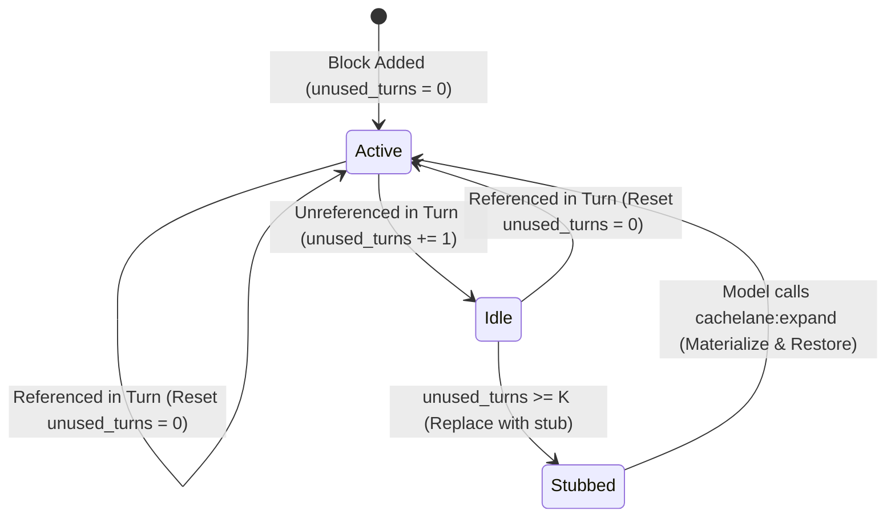

# CacheLane

[](https://nodejs.org)
[](LICENSE)
[]()

> **"A local cache-discipline layer for Claude Code."**
>
> CacheLane intercepts Claude Code conversation turns to organize prompt context blocks to minimize repeated input token costs. By leveraging Anthropic's prompt cache and dynamic turn-based block pruning, it reduces input billable token costs by **30% to 60%** in long sessions.

---

## Key Architectural Capabilities

CacheLane sits as a local middleware between Claude Code and `api.anthropic.com`. It has three primary mechanisms:

1. **Cache-Aware Prompt Orchestration (M1)**
   * Segregates incoming context into three volatility regions:
     * **`STABLE`**: System prompts, tool schemas, explicitly pinned files, and project rules.
     * **`SEMI`**: Stable recent-turn history window.
     * **`VOLATILE`**: Dynamic user queries, tool output content, and ephemeral contexts.
   * Places two `cache_control` breakpoints at the boundaries of these regions, allowing you to pay a heavily discounted **0.1×** input cost on cache hits instead of **1.0×** on every turn.

2. **Trajectory-Aware K-Pruning (M2)**
   * Evaluates usage references at the end of each turn.
   * If an injected block (such as long file contents or tool outputs) goes unreferenced for $\ge K$ consecutive turns (default $K=3$), CacheLane replaces it with a compact, non-lossy stub.
   * Stubs contain only the block ID, a brief summary, and a refetch handle, allowing Claude to request it back on-demand via the `cachelane:expand` tool if it needs the full details again.

3. **Hybrid Adaptive Keepalive (M6)**
   * Prevents Anthropic's 5-minute cache TTL from expiring during long pauses.
   * Automatically schedules minimal, low-cost synthetic pings (`max_tokens=1`) to keep the cache prefix hot.
   * Autodetects prefix size to adjust cache write tier behavior.

### Architectural Diagrams

#### Interception Hook Lifecycle


#### Orchestrated Prompt Layout


#### Trajectory K-Pruning State Diagram


---

## Security & Privacy (100% Local-First)

* **No SaaS Backend**: CacheLane is completely local. No prompt text, assistant responses, or file contents ever leave your machine except to go directly to `api.anthropic.com` over TLS.
* **Metadata-Only SQLite Logs**: The local database (`~/.cachelane/cachelane.db`) only stores block hashes, token counts, and hit statistics. It **never** persists prompt bodies, secrets, or file contents.
* **Opt-In Telemetry**: Telemetry is disabled by default. If enabled via the CLI, it reports only high-level aggregates (cache ratios, savings metrics) and strips file paths, prompt text, workspace IDs, and keys.

---

## Developer Onboarding & Installation

### Prerequisites
* **Node.js**: `v20.10.x` or later (Node 20 is recommended as native `better-sqlite3` bindings are precompiled for Node 20).
* **Claude Code**: `v0.6.x` or later.

### 1. Build and Link CacheLane Locally
```bash
# Clone the repository
git clone https://github.com/Aditya-Tripuraneni/CacheLane.git
cd CacheLane

# Install dependencies (Node 20 environment recommended)
npm install

# Compile the TypeScript project
npm run build

# Link the global command
npm link
```

### 2. Register CacheLane Hook & MCP Config
To register the CacheLane MCP server and hooks into your global Claude configuration, run:
```bash
cachelane install
```
This is fully idempotent. It will:
1. Register the MCP server in `~/.claude/mcp.json`.
2. Write the Hook descriptors into `~/.claude/hooks/`.
3. Create default configuration at `~/.cachelane/config.json`.

### 3. Verify the Installation
Run the self-diagnosis script to ensure everything is set up correctly:
```bash
cachelane doctor
```
If you are running in CI or automated environments, you can verify with:
```bash
npm run doctor:ci
```

---

## Why Trust CacheLane?

A caching layer must never break your editor or disconnect you from your assistant. We built CacheLane with strict production invariants:

### 1. Fail-Open by Design
If any part of CacheLane encounters an issue:
* SQLite errors (corrupt db, read/write locks, disk full)
* Config file corruption (reverts to standard defaults)
* Node version mismatches or startup exceptions
* Uncaught hook panic in the pre-request / post-response flow

The system logs the error to `~/.cachelane/logs/` and **immediately falls back to passing through the unmodified request** to Anthropic. It will **never** block the model, slow down Claude Code, or crash your session.

### 2. High-Coverage Automated Testing
The codebase has a comprehensive test suite of **268 passing tests** covering:
* **Migrations**: Multi-version SQLite migrations tested for safety.
* **Pipeline Integration**: Complete intercept-to-forward mock servers.
* **Keepalive Scheduler**: Time-mocked validation of adaptive pings.
* **Pruning Logic**: Multi-turn stubs creation and materialization.

To run the unit/integration tests:
```bash
# Verify using a Node 20 environment to match sqlite native bindings
PATH="/opt/homebrew/Cellar/node@20/20.20.2/bin:$PATH" npm test
```

### 3. Cache-Stability Gate
To prevent cache-busting drift (which occurs if unstable elements like random seeds, timestamps, or unordered system variables contaminate the stable prefix), our CI runs a strict **Cache-Stability Test**. It verifies that the SHA-256 hash of the orchestrated prefix region is **byte-identical** across 3 consecutive identical-input runs.

### 4. Deterministic Benchmark Harness
You can verify and audit the performance and savings of CacheLane locally without spending real API credits:
```bash
# Verify using a Node 20 environment
PATH="/opt/homebrew/Cellar/node@20/20.20.2/bin:$PATH" npm run benchmark:recorded
```
This script replays pre-recorded Claude Code sessions under simulated conditions, measuring:
* **Baseline cost units**: Total tokens paid without caching.
* **Effective cost units**: Total tokens paid under CacheLane's orchestration.
* **Savings Ratio**: Cost reduction achieved.
* Results are written to `/benchmark/runs/recorded-local/BENCHMARK-REPORT.md`.

---

## CLI & MCP Command Reference

### CLI Utilities
| Command | Purpose |
|---------|---------|
| `cachelane install` | Sets up MCP config, writes hooks, and constructs initial workspace database. |
| `cachelane doctor` | Diagnoses runtime health, checks Node versions, SQLite writability, and configuration. |
| `cachelane stats` | Prints cache hit ratio, turns, and estimated API savings. |
| `cachelane explain [--turn <N>]` | Explains how CacheLane categorized, reordered, or pruned blocks for turn `N`. |
| `cachelane prune --default \| --aggressive \| --conservative` | Configures K-pruning behavior ($K=3$, $K=2$, or $K=5$). |
| `cachelane keepalive off \| static \| adaptive \| auto` | Configures adaptive prompt TTL keepalive scheduling. |
| `cachelane pin <file\|glob>` | Protects files from ever being pruned, locking them in the `STABLE` region. |
| `cachelane exclude <file\|glob>` | Excludes specific files from cache-aware categorization. |
| `cachelane disable` / `enable` | Toggles CacheLane interception hooks without uninstalling. |
| `cachelane uninstall [--purge]` | Removes CacheLane from Claude Code; `--purge` deletes all local database/config. |

### MCP Tools (Exposed to Claude)
When the MCP server is running, Claude can call these tools:
* `cachelane:stats` — returns session/workspace cache stats.
* `cachelane:explain` — returns a structured report explaining region breakpoints.
* `cachelane:expand` — requested by the model when it encounters a pruned stub; causes CacheLane to fetch and restore the full content into the suffix for the next turn.

---

## Directories & Data Storage

All CacheLane state is stored locally:
* **Config file**: `~/.cachelane/config.json`
* **SQLite database**: `~/.cachelane/cachelane.db`
* **Logs**: `~/.cachelane/logs/` (rotated daily, 7-day retention)
* **Claude integration files**:
  * MCP server: `~/.claude/mcp.json`
  * Hook descriptors: `~/.claude/hooks/cachelane.json`
