# 04 — Turns and Pruning

**Purpose:** Complete algorithmic specification for the turn model and K-pruning algorithm.  
**Scope:** Algorithm-level — precise enough to implement and test against without reading the source doc.  
**Source:** `Cachelane_Turns_and_Pruning_Explainer.html` (intuition + worked examples) and
`Cachelane_Engineering_Diagrams_v2.html` D3 (decision rules).

---

## Turn Model — Definitions

| Term | Definition |
|------|------------|
| **Turn** | One user message plus the assistant's full reply. The atomic unit of Cachelane accounting. |
| **Turn boundary / end** | The moment the assistant stops talking and waits for the user. This is what advances the turn counter and ages content blocks. |
| **Tool call** | A function invocation made by the assistant inside its reply. Multiple tool calls per turn are allowed. Tool calls do NOT advance the turn counter. |
| **Content block** | Each tool-call result is one content block. This is the unit K-pruning operates on. |
| **Idle N** | A block whose `unused_turns` counter is N — it has not been referenced for N consecutive turns. |

**Key invariant:** "K-pruning measures age in turns, not in tool calls."

---

## Turn State Machine

The following state machine describes a **content block's** lifecycle (turns themselves have no
state in this model; they just advance the counter):

```mermaid
stateDiagram-v2
    [*] --> Active : block created (added in turn T)
    Active --> Active : referenced in current turn (reset counter to 0)
    Active --> Idle1 : turn T+1 ends without reference
    Idle1 --> Idle2 : turn T+2 ends without reference
    Idle2 --> IdleK_minus_1 : ... counter increments each turn
    IdleK_minus_1 --> Stubbed : unused_turns reaches K
    Stubbed --> Active : model calls cachelane:expand (refetch)
    Active --> [*] : (no explicit removal; stubs persist until refetched)
```



**Pinned / STABLE blocks** skip this state machine entirely — they are exempt and never tick.

---

## K-Pruning Algorithm

### Inputs

| Input | Description |
|-------|-------------|
| `blocks` | Ordered sequence of retained content blocks in the current prompt |
| `block.id` | Short ID injected on every stubbable block |
| `block.unusedTurns` | Current idle counter; loaded from SQLite reference log at PreRequest |
| `block.isStub` | Whether this block has already been pruned |
| `block.refetchHandle` | If stub: the command to restore original content (e.g. `"view:auth.py:23-89"`) |
| `currentTurn` | Turn number (increments at each turn boundary) |
| `K` | Idle-turn threshold (default 3, range 1–10) |
| `referencedBlockIds` | Set of block IDs detected as referenced in the assistant's output (output of reference detector) |

### Triggers

- Pruning runs at each turn boundary (after the assistant turn completes)
- **PreRequest phase**: load `unusedTurns` from SQLite; pass to Pruner
- **Pruner runs before Reorderer** (canonical pipeline order: Classifier → Pruner → Reorderer)
- **PostResponse phase**: run reference detection; update `unusedTurns` in SQLite

### Selection Policy

```python
# [SYNTHESIZED from prose and decision rules — canonical per D3 and Systems Design §4.3]

K = 3  # default; configurable

def prune_pass(blocks: list[Block], referenced_ids: set[str]) -> list[Block]:
    """Run after reference detection, before reordering."""
    result = []
    for block in blocks:
        if block.is_pinned or block.volatility == "STABLE":
            # Pinned and STABLE blocks are exempt — never tick
            result.append(block)
            continue

        if block.id in referenced_ids:
            block.unused_turns = 0  # referenced: reset counter
        else:
            block.unused_turns += 1  # not referenced: increment

        if not block.is_stub and block.unused_turns >= K:
            block = materialize_stub(block)  # replace with stub

        result.append(block)
    return result

def materialize_stub(block: Block) -> Block:
    """Replace block content with a compact placeholder."""
    return Block(
        id=block.id,              # PRESERVE original identifier
        kind="stub",
        volatility=block.volatility,
        token_count=STUB_TOKEN_COUNT,   # small constant
        content=f"[stub:{block.id}] {one_line_summary(block)} | refetch: {block.refetch_handle}",
        is_stub=True,
        refetch_handle=block.refetch_handle,
        unused_turns=block.unused_turns,  # keep for audit; won't tick further
    )
```

**Stubbing threshold:** `unused_turns >= K` (inclusive). A block created in turn T and never
referenced becomes: idle 1 at T+1, idle 2 at T+2, stubbed at T+3 (when K=3).

### Effects & Post-conditions

1. Stubbed blocks **remain in the prompt sequence** at their original position — just smaller
2. Stubs **retain the block's identifier** — so downstream reference detection still works
3. Stubs **never expire further** — `unused_turns` stops incrementing once stubbed
4. Stubs are **refetchable on demand** via `cachelane:expand` → non-lossy at the application layer
5. The Reorderer receives the **post-pruned** block list — breakpoints are computed on final sizes

### Invariants

| # | Invariant |
|---|-----------|
| I1 | Identity preservation: a stub keeps the same `id` as the original block |
| I2 | Non-lossy: stubs carry a `refetch_handle`; original content is always recoverable |
| I3 | Turn-counted aging: age is measured in turns, not in tool calls or wall-clock time |
| I4 | Turn definition: 1 user message + 1 assistant reply (tool calls inside do not split) |
| I5 | Sequence preservation: stubs occupy the same position in the prompt as the original block |
| I6 | Pinned/STABLE exemption: these blocks never tick and are never stubbed |
| I7 | Stubs are themselves blocks and do not tick further |
| I8 | `(tool_use, tool_result)` pairs are moved only as atomic units by the Reorderer |

### Complexity Analysis

| Operation | Complexity | Notes |
|-----------|-----------|-------|
| Reference detection (signals 1+2) | O(B) | B = block count; fast hash/substring lookup |
| Reference detection (signal 3 — 40-char shingle) | O(B × \|text\|) | Only runs on blocks not matched by signals 1+2; bounded at ~5ms for 100 blocks / 10KB response |
| Pruning pass | O(B) | One comparison per block |
| Total per-turn PostResponse overhead | < 20 ms | Typical session; latency-invisible (response already streaming) |

Typical block counts: 50–200 per session.

---

## Reference Detection

**Three-signal deterministic detection** (no embeddings, no ML):

| Signal | Mechanism | Example |
|--------|-----------|---------|
| 1 — file paths in tool calls | Exact string match of known file paths in assistant's tool-call arguments | `{"path": "src/auth.py"}` references block `file:auth.py` |
| 2 — block IDs in assistant text | Substring match of the injected ID prefix in assistant's final text or tool call strings | `"01J..."` appears in assistant reasoning |
| 3 — 40-char shingle overlap | Exact 40-char sliding-window substring match between block content and assistant output | Content of block appears verbatim in assistant reply |

**Evaluation order:** Signal 1 first, signal 2 next, signal 3 last (signal 3 is the expensive case;
only runs on blocks not matched by 1 or 2).

**Quality gate:** Precision ≥ 95%, Recall ≥ 85% on the 100-session annotated corpus (AC-5, AC-6).
The corpus must exist **before** any pruner code is written.

---

## Worked Examples

### Example A — What counts as a turn

| Turn | User message | Assistant reply (tool calls inside) |
|------|-------------|-------------------------------------|
| T1 | "fix the bug" | read file, edit, explain |
| T2 | "add a test" | write test, run pytest |
| T3 | "now refactor" | read 3 files, edit, commit |
| T4 | "looks good" | summarise, done |

- "In Turn 1, the assistant might call read 4 files and run pytest. Those are 5 tool calls but
  still **one turn**."
- "Each tool call result becomes a content block. K-pruning measures age in turns, not tool calls."
- "A block added in Turn 1 and never referenced again becomes idle 1 by Turn 2, idle 2 by Turn 3,
  and is **stubbed at Turn 4**." (K=3: idle 3 is the threshold)

### Example B — Token count over time (K=3)

| Turn | Without pruning | With K-pruning (K=3) | Savings |
|------|----------------|---------------------|---------|
| T1 | 5k | 5k | 0 |
| T2 | 9k | 9k | 0 |
| T3 | 15k | 15k | 0 |
| T4 | 22k | 17k | 5k (23%) |
| T5 | 30k | 19k | 11k (37%) |
| T6 | 38k | ~19k | ~19k (~50%) |

- "Turns 1–3: both columns identical. Nothing is old enough to prune yet."
- "Turn 4: blocks added in Turn 1 hit idle 3 and become stubs. Left column keeps growing.
  Right column flattens."
- "By turn 6, the pruned session is roughly half the size of the unpruned one."
- "Every turn pays the input-token cost of the entire prompt. A 38k prompt costs about 2× what a
  19k prompt costs. Across a long session those savings compound on every subsequent turn."
- "Pruning is not lossy. Stubbed blocks keep their identifier and can be refetched on demand if
  Claude needs them again."

### Example C — Full 5-turn block lifecycle (from D3)

See [Architecture §K-Pruning Walkthrough](02-architecture.md#k-pruning-walkthrough-d3) for the
full timeline matrix (Blocks A–D across turns T1–T5).

---

## Edge Cases

| Scenario | Behaviour |
|----------|-----------|
| Empty conversation | No blocks; pruner is a no-op |
| Single-turn session | `unused_turns = 0` for all blocks; nothing reaches K |
| K=0 | Not a valid configuration (minimum K=1 per config schema range) |
| K=1 | Every block that is not referenced in the current turn is immediately stubbed |
| Block referenced again before idle ≥ K | Counter resets to 0; block stays active |
| Block already stubbed and re-referenced (model calls `cachelane:expand`) | Restored to active; `unused_turns` resets to 0 |
| Very small block (few tokens) | Still eligible for stubbing if idle ≥ K |
| Large reply with many tool calls in one turn | All resulting blocks share the same creation turn; they age together |
| Pinned block | Never ticks; exempt from all pruning |
| `STABLE` block | Never ticks; exempt |
| `/compact` runs | All replaced blocks are removed from the reference log; compacted summary is a new `SEMI` block with `unused_turns=0` |
| Mid-turn failure (assistant errors before reply ends) | Turn boundary is "assistant stops talking"; unclear if error counts — see [Open Questions §Q009](07-open-questions.md) |
| Two sessions sharing same SQLite | WAL mode serialises writes; counters remain consistent |

---

## Configuration Knobs

| Name | Type | Default | Range | Effect |
|------|------|---------|-------|--------|
| `pruner.k` | int | 3 | 1–10 | Idle-turn threshold before stubbing. Lower = more aggressive token savings + more refetches. Higher = less aggressive + larger prompts. |
| `pruner.mode` | enum | `"default"` | `default \| conservative \| aggressive` | Sets K to 3, 5, or 2 respectively when using CLI modes |
| `pruner.enabled` | bool | `true` | true/false | Toggle K-pruning entirely |

**K=2 (aggressive):** Stubs appear starting at turn 3. Higher token savings; higher refetch rate.  
**K=3 (default):** Stubs appear starting at turn 4. Conservative bound on refetch cost.  
**K=5 (conservative):** Stubs appear starting at turn 6. Minimal refetch risk; less savings.

---

## Interaction with Prompt Caching

- Stubs replace bytes **in place** while keeping identifiers → prefix structure up to the first stub
  is preserved → cache prefixes before the first stub remain hot across turns
- Any cache prefix **past** the first stubbed slot diverges from the pre-prune version and will
  miss the cache on that segment
- Implication: placing frequently-referenced blocks early (in the stable prefix region) prevents
  cache misses from stubs appearing in the prefix
- The Pruner runs before the Reorderer — the Reorderer receives the final (post-stub) block set
  and places breakpoints that reflect the actual byte layout

---

## Open Questions

| ID | Question |
|----|----------|
| Q001 | Reference detection precision/recall must be validated on the 100-session corpus before the pruner ships |
| Q003 | Optimal K value is a starting guess of 3; per-scenario experiment planned (see §2.4 of Phase 2 spec) |
| Q009 | What counts as "the turn end" if the assistant errors mid-reply? Does `unusedTurns` still tick? |
| Q010 | What counts as "referencing" a block at the semantic level — verbatim cite, paraphrase, or just using info from it? Only the 3-signal detector definition is binding; anything else is undefined. |

See [`07-open-questions.md`](07-open-questions.md) for full list.
